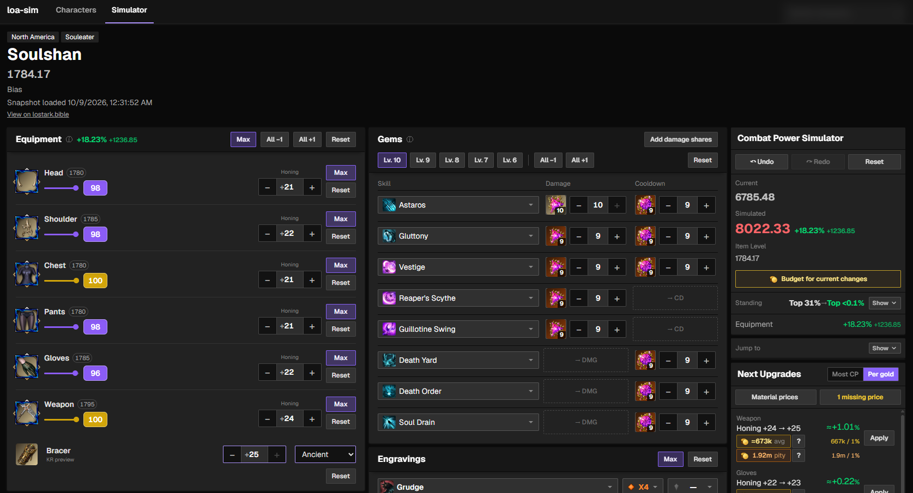
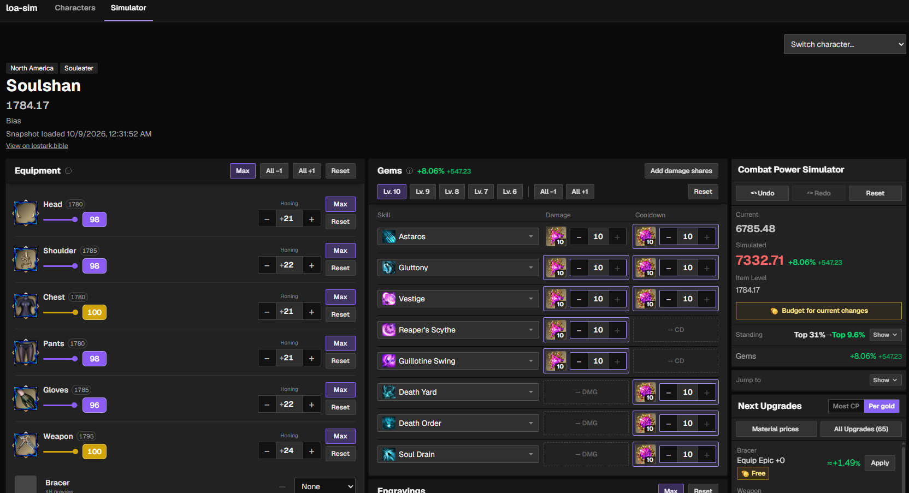
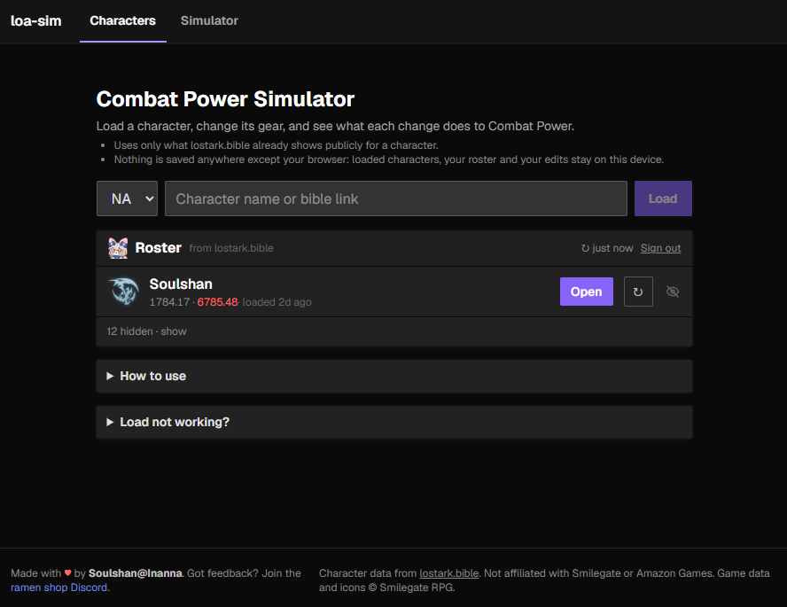

<div align="center">

# loa-sim

**Combat Power simulator for Lost Ark (NA / CE)**

Load your character, change your gear, and see exactly what each change does to your Combat Power.

**[loa-sim.vercel.app](https://loa-sim.vercel.app)** · [ramen shop Discord](https://lostark.bible/discord) · character data from [lostark.bible](https://lostark.bible)



</div>

## What it does

- **Starts from your real number.** The simulator begins at lostark.bible's exact Combat Power and applies every edit
  on top of it.
- **Edit everything:** honing and advanced honing, bracer, Sidereal weapons, accessories line by line, bracelet,
  gems, engravings and ability stones, ark grid cores and astrogems, karma, and skins. CP updates as you type.
- **Next Upgrades:** the best next steps for your character, ranked by **Most CP** or **Per gold**. Honing costs come
  from material prices you enter, with your bound mats used first, and show average and pity cost.
- **Whole accessories:** accessories are compared as whole pieces, the way you'd buy them on the market. Pick which
  rolls to consider (H-H, H-M, M-H, H-L, L-H, M-M).
- **Standing:** see where your CP ranks, now and after your changes.
- **Works on your phone.**

<div align="center">

</div>

## How to use

1. Open **[loa-sim.vercel.app](https://loa-sim.vercel.app)**.
2. Pick your region and type your character name (or paste a lostark.bible link), or sign in with lostark.bible to
   load your roster.
3. Change things and watch the CP. Use **Next Upgrades** to see what to do next.

To get your current gear, set it up in game, go to character select, then hit reload on the character. That's when a
fresh snapshot reaches lostark.bible.

<div align="center">

</div>

## FAQ

**Is my data stored anywhere?**
No. Loaded characters, your roster and your edits stay in your browser. The app only reads what lostark.bible already
shows publicly.

**Why is my number slightly off after an edit?**
Some parts of the CP formula aren't public. Rows marked `≈` are estimates. Bracer numbers are a KR preview.

**Why no gold cost for cores and astrogems?**
Their gold efficiency can't be reliably calculated, so they're ranked by CP only.

**Feedback or a bug?**
Join the [ramen shop Discord](https://lostark.bible/discord).

## Disclaimer

loa-sim is a fan-made tool. It is not affiliated with or endorsed by Smilegate RPG or Amazon Games. Lost Ark game data
and icons © Smilegate RPG. Character data comes from [lostark.bible](https://lostark.bible).

Made with ♥ by Soulshan@Inanna.

---

## Development

```bash
npm install
```

```bash
npm run dev
```

Then open http://localhost:5173.

```bash
npm test
```

### Layout

- `src/lib/upgrade-planner/` holds the simulator and Next Upgrades, built to drop into lostark.bible. See
  [INTEGRATION.md](INTEGRATION.md).
  - `simulate.ts` is the simulator engine; `Simulator.svelte` and `sim/` are its UI.
  - `cp.ts` / `tables.ts` / `honing-data.ts` hold the CP formula and battle point tables.
  - `live-upgrades.ts`, `accessory-sets.ts`, `honing-cost.ts` and `UpgradePlanner.svelte` are Next Upgrades.
- `src/lib/demo/` and `src/routes/` hold the SvelteKit app around it.
- `src/lib/server/bible.ts` loads live characters.
- `scripts/bake-game-data.mjs` regenerates the honing tables, icons and bracelet catalog from the game data.
- `legacy/` has the first standalone prototype.

### Loading a character

Players load their own character on the home page, three ways:

- **Sign in with lostark.bible** (OAuth, Authorization Code + PKCE). The app reads the player's linked rosters and
  lists their characters; picking one loads it. The token stays in the player's browser for its 90 days.
- **Load by name**: type a name (or bible link) and press Load.
- **Paste**: open the character's lostark.bible data link, copy all of it and paste it in (the fallback).

Loading goes through this app's server (`/api/character/<region>/<name>`): browsers can't fetch bible's character
data themselves (no CORS), and bible's OAuth API has no gear yet. lostark.bible's developer has OK'd fetching it
server-side, one character per player action; the server caches each character for a few minutes and shares one
request between simultaneous loads. Set `BIBLE_SERVER_FETCH=0` to turn it off (see `.env.example`); players then
paste instead. Either way the data is decoded and saved in the player's browser, so a return visit opens straight
into the simulator.

The selected region is remembered in localStorage; an explicit region in a reload link takes precedence.

OAuth redirect URIs registered with lostark.bible: `https://loa-sim.vercel.app` (production client) and
`http://localhost:5173/oauth-test` (development client; `/oauth-test` also hosts a dev-only API inspector).
